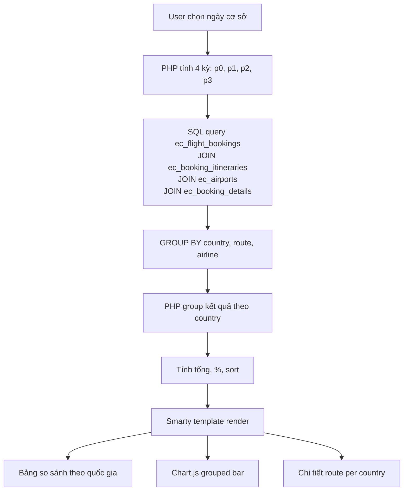

# Báo Cáo Phân Tích Hành Trình — Đề Xuất Triển Khai (v2)

## Mục tiêu

Xây dựng một view report mới trong module `EC_Flight_Bookings` cho phép:
1. Xem tổng quan booking/vé theo **từng quốc gia** (tất cả quốc gia có trong data, không hardcode)
2. **So sánh tự động** với hôm qua, hôm kia, cùng kỳ tuần trước (cùng thứ trong tuần)
3. Phân tích chi tiết theo route (hành trình cụ thể)

---

## Phân Tích Dữ Liệu

### Nguồn dữ liệu

| Table | Fields quan trọng | Vai trò |
|---|---|---|
| `ec_booking_itineraries` | `departure`, `arrival` (IATA 3-char), `departure_date`, `airline_code`, `direction`, `add_type`, `booking_id` | Hành trình bay |
| `ec_flight_bookings` | `date_entered` (UTC), `booking_status` (1-8), `total_amount`, `deleted` | Booking chính |
| `ec_booking_details` | `booking_id`, `quantity` | Số vé mỗi booking |
| **`ec_airports`** | `iata_code` (unique, 3-char), `country` (ISO 2-char, enum `region_dom`), `city_name`, `geo_country` (khu vực địa lý) | **Mapping IATA → quốc gia** |

### Bảng ec_airports — Schema quan trọng
- `iata_code` (varchar 3, unique index) — khớp trực tiếp với `departure`/`arrival` trong itineraries
- `country` (enum, 2-char ISO) — mã quốc gia: `VN`, `JP`, `KR`, `AU`, `TH`, `US`, ...
- `geo_country` (enum) — khu vực địa lý lớn: `1`=Việt Nam, `2`=ĐNA, `3`=Châu Á, `4`=Châu Âu, `5`=Châu Mỹ, `6`=Châu Phi, `7`=Nam Phi, `8`=Châu Đại Dương
- `city_name` — tên thành phố hiển thị
- Label quốc gia: `$app_list_strings['region_dom']` (~220 quốc gia có tên tiếng Việt)

> [!TIP]
> **Ưu điểm lớn**: Bằng cách JOIN `ec_airports` trên `iata_code`, ta có thể tự động phân loại hành trình theo **quốc gia thực tế** mà không cần hardcode danh sách. Khi thêm sân bay mới vào `ec_airports`, report sẽ tự động nhận diện.

---

## Đề Xuất Phương Án

### Tạo view mới `report_route_analysis` trong module EC_Flight_Bookings

View report mới hoàn toàn, **không tái sử dụng SQL từ `airportstatistics`**, với thiết kế SQL riêng tận dụng bảng `ec_airports` để phân loại quốc gia.

---

## Proposed Changes

### EC_Flight_Bookings Module

#### [NEW] [view.report_route_analysis.php](file:///home/bak_vmbwsite/public_html/modules/EC_Flight_Bookings/views/view.report_route_analysis.php)

View class `Viewreport_route_analysis extends SugarView` — trung tâm logic của báo cáo.

**Thiết kế UI:**

```
┌──────────────────────────────────────────────────────────────┐
│ HEADER: Phân tích hành trình theo quốc gia                  │
│ [Dropdown: Hôm nay/Hôm qua/...] [Từ ngày] [Đến ngày]       │
├──────────────────────────────────────────────────────────────┤
│                                                              │
│ ▼ BẢNG SO SÁNH THEO QUỐC GIA ĐÍCH (auto từ data)           │
│ ┌─────────┬───────┬────────┬────────┬───────┬────────┬────────┐ │
│ │ Quốc gia│Kỳ chọn│Kỳ chọn │Kỳ chọn │Tuần Tr│Tuần Tr │Tuần Tr │ │
│ │         │(T)    │-1 (T-1)│-2 (T-2)│(T-7)  │-1 (T-8)│-2 (T-9)│ │
│ ├─────────┼───────┼────────┼────────┼───────┼────────┼────────┤ │
│ │ 🇻🇳 VN  │ 45 BK │ 50 BK  │ 42 BK  │ 48 BK │ 40 BK  │ 35 BK  │ │
│ │         │ (35OK)│ (40OK) │ (30OK) │ (45OK)│ (38OK) │ (30OK) │ │
│ │         │ ↓ 6%* │        │        │       │        │        │ │
│ ├─────────┼───────┼────────┼────────┼───────┼────────┼────────┤ │
│ │ 🇯🇵 JP  │ 8 BK  │ 6 BK   │ 5 BK   │ 7 BK  │ 6 BK   │ 5 BK   │ │
│ ├─────────┼───────┼────────┼────────┼───────┼────────┼────────┤ │
│ │ ...     │       │        │        │       │        │        │ │
│ └─────────┴───────┴────────┴────────┴───────┴────────┴────────┘ │
│ * % thay đổi có thể so sánh giữa (T) và (T-7)                   │
│                                                              │
│ ▼ CHART: Grouped bar chart (Chart.js) — Top N quốc gia      │
│ [4 cột/quốc gia x top 10 quốc gia theo booking hôm nay]    │
│                                                              │
│ ▼ BẢNG CHI TIẾT ROUTE — Click vào ô số liệu của kỳ nào thì expand hiển thị chi tiết của kỳ đó
│ ┌──────┬────────┬────────┬──────┬──────┐
│ │ STT  │ Nơi đi │Nơi đến │BK <Kỳ>│Vé <Kỳ>│
│ ├──────┼────────┼────────┼──────┼──────┤
│ │ 1    │SGN(HCM)│SYD(Syd)│  3   │  8  │
│ │ 2    │HAN(HN) │MEL(Mel)│  2   │  4  │
│ └──────┴────────┴────────┴──────┴──────┘
└──────────────────────────────────────────────────────────────┘
```

**Logic xử lý dữ liệu (SQL mới, KHÔNG reuse từ airportstatistics):**

1. **Xác định 4 kỳ so sánh** dựa trên khoảng thời gian (`from_date`, `to_date`):
   - `p0`: khoảng thời gian đã chọn (ví dụ: `01/07` - `03/07`)
   - `p1`: khoảng thời gian liền trước (ví dụ: `28/06` - `30/06`, lùi X ngày)
   - `p2`: khoảng thời gian liền trước nữa (ví dụ: `25/06` - `27/06`, lùi 2X ngày)
   - `p3`: cùng kỳ tuần trước (lùi 7 ngày so với `from_date`, `to_date`)

2. **SQL chính — Query 1 lần, JOIN `ec_airports` để lấy quốc gia:**

```sql
SELECT
    ap_dest.country AS dest_country,
    routes.departure,
    routes.arrival,
    ap_dest.city_name AS dest_city,
    ap_dep.city_name AS dep_city,

    -- Kỳ 0: Khoảng tgian chọn
    COUNT(CASE WHEN routes.period = 0 THEN 1 END) AS bk_p0,
    SUM(CASE WHEN routes.period = 0 AND routes.booking_status IN ('8','7','3') THEN 1 ELSE 0 END) AS bk_p0_ok,
    SUM(CASE WHEN routes.period = 0 THEN routes.ticket_qty ELSE 0 END) AS ticket_p0,
    -- Kỳ 1: Kỳ trước
    COUNT(CASE WHEN routes.period = 1 THEN 1 END) AS bk_p1,
    SUM(CASE WHEN routes.period = 1 AND routes.booking_status IN ('8','7','3') THEN 1 ELSE 0 END) AS bk_p1_ok,
    SUM(CASE WHEN routes.period = 1 THEN routes.ticket_qty ELSE 0 END) AS ticket_p1,
    -- Kỳ 2: Kỳ trước nữa
    COUNT(CASE WHEN routes.period = 2 THEN 1 END) AS bk_p2,
    SUM(CASE WHEN routes.period = 2 AND routes.booking_status IN ('8','7','3') THEN 1 ELSE 0 END) AS bk_p2_ok,
    SUM(CASE WHEN routes.period = 2 THEN routes.ticket_qty ELSE 0 END) AS ticket_p2,
    -- Kỳ 3: Tuần trước
    COUNT(CASE WHEN routes.period = 3 THEN 1 END) AS bk_p3,
    SUM(CASE WHEN routes.period = 3 AND routes.booking_status IN ('8','7','3') THEN 1 ELSE 0 END) AS bk_p3_ok,
    SUM(CASE WHEN routes.period = 3 THEN routes.ticket_qty ELSE 0 END) AS ticket_p3

FROM (
    SELECT
        sub.booking_id,
        sub.departure,
        sub.arrival,
        sub.booking_status,
        sub.period,
        IFNULL(bkd.qty, 0) AS ticket_qty
    FROM (
        SELECT
            b.id AS booking_id,
            b.booking_status,
            -- Lấy sân bay đi đầu tiên và sân bay đến cuối cùng (theo thời gian)
            MIN(i.departure) AS departure,       -- departure của leg đầu
            SUBSTRING_INDEX(
                GROUP_CONCAT(i.arrival ORDER BY i.departure_date DESC), ',', 1
            ) AS arrival,                         -- arrival của leg cuối
            CASE
                WHEN DATE(CONVERT_TZ(b.date_entered, '+00:00', '+07:00')) BETWEEN '{$p0_from}' AND '{$p0_to}' THEN 0
                WHEN DATE(CONVERT_TZ(b.date_entered, '+00:00', '+07:00')) BETWEEN '{$p1_from}' AND '{$p1_to}' THEN 1
                WHEN DATE(CONVERT_TZ(b.date_entered, '+00:00', '+07:00')) BETWEEN '{$p2_from}' AND '{$p2_to}' THEN 2
                WHEN DATE(CONVERT_TZ(b.date_entered, '+00:00', '+07:00')) BETWEEN '{$p3_from}' AND '{$p3_to}' THEN 3
            END AS period
        FROM ec_flight_bookings b
        INNER JOIN ec_booking_itineraries i
            ON i.booking_id = b.id
            AND i.deleted = 0
            AND i.direction = 0
            AND i.add_type = 0
        WHERE b.deleted = 0
          AND (
              DATE(CONVERT_TZ(b.date_entered, '+00:00', '+07:00')) BETWEEN '{$p0_from}' AND '{$p0_to}' OR
              DATE(CONVERT_TZ(b.date_entered, '+00:00', '+07:00')) BETWEEN '{$p1_from}' AND '{$p1_to}' OR
              DATE(CONVERT_TZ(b.date_entered, '+00:00', '+07:00')) BETWEEN '{$p2_from}' AND '{$p2_to}' OR
              DATE(CONVERT_TZ(b.date_entered, '+00:00', '+07:00')) BETWEEN '{$p3_from}' AND '{$p3_to}'
          )
        GROUP BY b.id
    ) sub
    LEFT JOIN (
        SELECT booking_id, SUM(quantity) AS qty
        FROM ec_booking_details
        WHERE deleted = 0
        GROUP BY booking_id
    ) bkd ON bkd.booking_id = sub.booking_id
) routes
-- JOIN ec_airports để lấy quốc gia
INNER JOIN ec_airports ap_dest
    ON ap_dest.iata_code = routes.arrival
    AND ap_dest.deleted = 0
LEFT JOIN ec_airports ap_dep
    ON ap_dep.iata_code = routes.departure
    AND ap_dep.deleted = 0
GROUP BY ap_dest.country, routes.departure, routes.arrival
ORDER BY bk_p0 DESC, ap_dest.country
```

3. **Xử lý PHP:**
   - Nhận kết quả SQL → group theo `dest_country`
   - Map `dest_country` → tên quốc gia qua `$app_list_strings['region_dom'][$country_code]`
   - Tính tổng BK/vé cho từng quốc gia và từng kỳ
   - Tính % thay đổi: `($bk_p0 - $bk_pN) / $bk_pN * 100` (so với kỳ cơ sở)
   - Sort theo tổng BK p0 giảm dần
   - Build chart data cho Chart.js (top 10 quốc gia)

> [!NOTE]
> **Điểm khác biệt so với `airportstatistics`**:
> - Không dùng window function `FIRST_VALUE`/`LAST_VALUE` → dùng `GROUP_CONCAT` + `SUBSTRING_INDEX` (tương thích MySQL tốt hơn)
> - JOIN `ec_airports` để lấy country thay vì hardcode airport list trong PHP
> - Query 4 kỳ cùng lúc bằng `CASE WHEN period` thay vì 1 kỳ duy nhất
> - Nhóm theo **quốc gia** (từ `ec_airports.country`) thay vì theo **route cụ thể**

#### [NEW] [view_route_analysis.tpl](file:///home/bak_vmbwsite/public_html/modules/EC_Flight_Bookings/tpls/view_route_analysis.tpl)

Smarty template cho UI:
- Bootstrap 5 (đã có trong theme SuiteP)
- Chart.js + chartjs-plugin-datalabels (đã dùng ở nơi khác)
- Date picker `Calendar.setup` (pattern chuẩn SuiteCRM)
- Responsive mobile-friendly
- Color-coded % thay đổi: xanh `↑` = tăng, đỏ `↓` = giảm
- Click vào tên quốc gia → collapse/expand bảng chi tiết route bên dưới
- Cột header hiển thị **ngày thực tế** (VD: "01/07 (T3)") để dễ đọc

#### [MODIFY] [action_view_map.php](file:///home/bak_vmbwsite/public_html/modules/EC_Flight_Bookings/action_view_map.php)

Thêm 1 dòng:
```diff
+$action_view_map['report_route_analysis'] = 'report_route_analysis';
```

#### [MODIFY] [controller.php](file:///home/bak_vmbwsite/public_html/modules/EC_Flight_Bookings/controller.php)

Thêm case `report_route_analysis` vào switch `process()` và xử lý `return_action`:
```diff
             case "bookerips":
                 $this->action = "bookerips";
                 break;
+            case "report_route_analysis":
+                $this->action = "report_route_analysis";
+                break;
             default:
```

```diff
         if ($this->return_action == "telesaleipmgr")
             $this->action = "telesaleipmgr";
+        if ($this->return_action == "report_route_analysis")
+            $this->action = "report_route_analysis";
```

---

## Data Flow



---

## Quyết Định Thiết Kế

### 1. Doanh số (Revenue)

**Cách `airportstatistics` xử lý hiện tại:**
- Dùng `calculateBKTotalAmtBatch(array $booking_ids)` — lấy danh sách `booking_id` theo route, sau đó tính revenue theo **booking** (không phải theo hành trình).
- Công thức: `total_amount + điểm_đổi + hoàn_vé_tongtienhang - giá_mua - hành_lý_mua - hoàn_vé_tongtienkhach - điểm_dùng`
- Chỉ tính với booking có `booking_status IN ('8','7','3')`.
- **Vấn đề**: Revenue gắn với **booking**, không phải với route cụ thể trong booking. Booking khứ hồi, transit thì revenue không chia được theo từng chặng. `airportstatistics` gán toàn bộ revenue của booking vào route đầu tiên/cuối cùng (departure - arrival tổng).

**Quyết định cho `report_route_analysis`:**

> [!NOTE]
> **Không tính doanh số** trong báo cáo phân tích hành trình này — vì hiện chưa có logic thống nhất để phân bổ doanh số theo hành trình (khứ hồi, transit làm phức tạp việc quy kết revenue). Report này tập trung vào **số lượng booking và số vé** — đủ để trả lời câu hỏi "hôm nay mình bán được bao nhiêu vé đi Nhật/Úc/Hàn".

**Metrics hiển thị (cuối cùng):**
- Số booking (`bk_p0..p3`)
- Số BK Hoàn Tất (`bk_p0_ok..p3_ok` - status 8, 7, 3) — Hiển thị dạng `3/5 BK OK`
- Số vé (`ticket_p0..p3`)
- % thay đổi so với kỳ cơ sở
- Có thể click vào số BK để mở modal danh sách booking chi tiết.

---

### 2. Menu Entry

**Cách Menu.php hoạt động:** Mỗi item là array `[url, label, icon, module]`. Report manager-only được đặt trong block `if(isManagerUser($current_user->id))` — giống pattern của `airportstatistics` hiện tại.

#### [MODIFY] [Menu.php](file:///home/bak_vmbwsite/public_html/modules/EC_Flight_Bookings/Menu.php)

Thêm menu item vào block `isManagerUser`, ngay sau item `airportstatistics`:

```diff
     $module_menu[] = [
         "index.php?module=EC_Flight_Bookings&action=airportstatistics&...",
         "Phân tích hành trình",
         "airplane_16",
         "EC_Flight_Bookings"
     ];

+    $module_menu[] = [
+        "index.php?module=EC_Flight_Bookings&action=report_route_analysis&return_module=EC_Flight_Bookings&return_action=report_route_analysis",
+        "Hành trình theo quốc gia",
+        "airplane_16",
+        "EC_Flight_Bookings"
+    ];
```

---

## Verification Plan

### Manual Verification
1. Truy cập qua menu "Hành trình theo quốc gia" (chỉ manager thấy)
2. Kiểm tra bảng hiển thị đúng **tất cả quốc gia** có trong data (không hardcode)
3. Đổi ngày cơ sở → 4 kỳ so sánh cập nhật đúng với ngày thực tế
4. Click quốc gia → expand/collapse chi tiết route đúng
5. Chart.js render đúng top quốc gia theo số booking hôm nay
6. Kiểm tra quốc gia mới (thêm sân bay vào `ec_airports`) tự động xuất hiện trong report

### Automated Tests
```bash
php -l modules/EC_Flight_Bookings/views/view.report_route_analysis.php
```

---

## Ước Lượng

| File | Mô tả | Kích thước ước lượng |
|---|---|---|
| `view.report_route_analysis.php` | View class + SQL mới + logic group country | ~350-450 dòng |
| `view_route_analysis.tpl` | Smarty template (table + chart + detail) | ~400-500 dòng |
| `action_view_map.php` | +1 dòng | 1 dòng |
| `controller.php` | +2 case blocks | ~6 dòng |
| `Menu.php` | +1 menu item trong isManagerUser block | ~6 dòng |
| **Tổng** | | **~750-960 dòng** |
